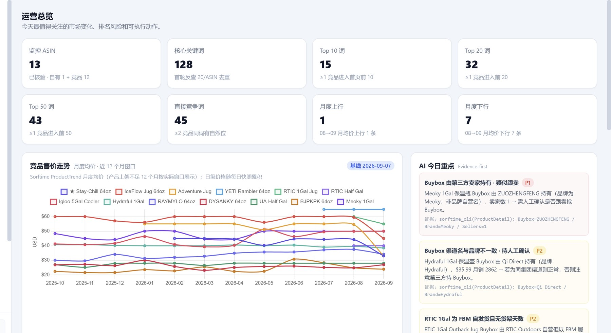
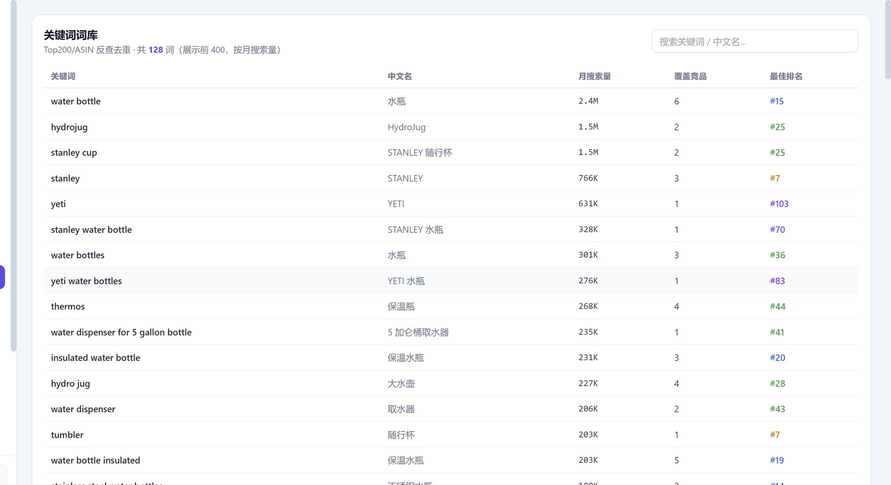
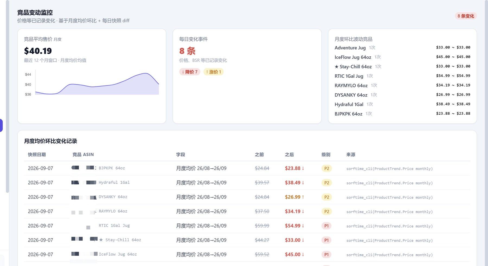

# Sorftime Amazon Seller Skills

**23 个开箱即用的 AI 技能包** — 让你的 AI 助手直接调用 Sorftime 真实数据，完成**选品、市场分析、竞品监控、Listing 优化、广告规划、利润测算**。

> *23 production-ready AI skills that give your agent real Amazon product data via [Sorftime](https://open.sorftime.com). Works with WorkBuddy / Claude Code / Codex / Cursor.*

[](LICENSE)
[](#技能一览)
[](#安装)

---

## 先领一个 Sorftime 账号

所有技能都依赖 [Sorftime](https://open.sorftime.com) 的数据接口。没有账号走专属通道注册：

### 👉 [点此注册 Sorftime（含 7 天免费试用）](https://www.sorftime.com?tag=ODI4OA%7E%7E) ｜ 优惠码 `8288`

> 专属通道的 7 天免费试用，**时长和调用次数都是官网自助领取的双倍**。后续续费走同一通道，优惠码长期有效。
>
> **需要复制链接的场合**请用这一串（`%7E%7E` 就是 `~~` 的 URL 编码，功能完全一样，但贴到微信 / 邮件 / 任何平台都不会被截断）：
> `https://www.sorftime.com?tag=ODI4OA%7E%7E`


> 也可以直接**扫码加我企业微信** —— 有具体问题当面问：要试用、问类目、挑卖家，都比自助注册快。

---

## 它解决什么问题

| 你的问题 | 会发生什么 |
|---|---|
| 「帮我看看 artificial flowers 这个类目能不能做」 | 出市场分析报告，给 go / no-go 结论、价格带甜区、品牌集中度 |
| 「算一下 B0XXXXXXXX 这个品能不能赚钱」 | 出利润测算、盈亏平衡点、隐赚评分 |
| 「给这个产品建关键词词库」 | 出四分类词库（核心 / 长尾 / 场景 / 痛点），带竞争度评分 |
| 「帮我搭一个竞品监控工作台，主品 ASIN 是 B0XXXXXXXX」 | 自动发现竞品、抓数据、生成可双击打开的多页监控看板 |
| 「按最新规则写一条 listing」 | 出符合 A9 + COSMO 的标题 + 五点 + 描述 |
| 「一键全流程：<品类名>」 | 市场分析 → 1688 找货源 → 算利润，串联执行 |

不用记哪个技能管什么，直接用 `amz-oneclick` 的一键口令：`一键市场：xx` / `一键找货` / `一键VOC` / `一键广告` / `一键全流程：xx`。

---

## 产出长什么样

下面三张**不是设计稿**，是技能真跑出来的产物 —— 输入一个主推 ASIN，自动发现竞品、反查关键词、监控价格变化，最后生成一个双击就能打开的多页工作台。

### ① 运营总览：今天该关注什么



自动标出 P1 / P2 级风险，**每条结论都附证据来源**。例如它会直接告诉你：

> 「Meoky 1Gal 保温瓶 Buybox 由 ZUOZHENGFENG 持有（品牌为 Meoky，非品牌自营名），卖家数 1 → 需人工确认是否被跟卖抢 Buybox」
> 证据：`sorftime_cli(ProductDetail)`：Buybox=ZUOZHENGFENG / Brand=Meoky / Sellers=1

### ② 关键词词库：128 个词 + 月搜索量 + 你排第几



按 ASIN 反查去重得到 128 个词，带月搜索量（`water bottle` 2.4M、`hydrojug` 1.5M…）和你在每个词上的最佳排名（#15、#25…）。哪些词该投广告、哪些是流量缺口，一眼看清。

### ③ 竞品变动监控：谁在降价，降了多少



基于月度均价环比 + 每日快照 diff，P1 = 价差 ≥$5。这张表直接摊开竞品本月的动作 —— 比如 `RTIC 1Gal` 从 $59.99 降到 $54.99、`Stay-Chill 64oz` 从 $44.27 降到 $33.00。

---

## 安装

### 第 1 步 · 放技能文件

```bash
git clone https://github.com/<你的用户名>/sorftime-amazon-seller-skills.git
cd sorftime-amazon-seller-skills

# 按你用的工具选一条（把 skills/ 下所有目录复制过去）
# WorkBuddy
cp -r skills/* ~/.workbuddy/skills/
# Claude Code
cp -r skills/* ~/.claude/skills/
# Codex
cp -r skills/* ~/.codex/skills/
```

Windows PowerShell：

```powershell
Copy-Item -Path .\skills\* -Destination $HOME\.workbuddy\skills\ -Recurse -Force
```

或者直接跑 `install.sh` / `install.ps1`，脚本会自动检测并复制。

### 第 2 步 · 配置数据通道

```bash
npm install -g sorftime-cli
sorftime add myprofile <你的 Account-SK>
sorftime use myprofile
```

> Account-SK 在 Sorftime 后台的 **API / CLI 服务**页面复制。注意：它和 **MCP key 不是同一个**，填错会报 401。

### 第 3 步 · 验证

```bash
python3 ~/.workbuddy/skills/amz-selection/scripts/channel_check.py
```

输出 `cli_available: true` 就绪。

### 环境要求

- Node.js ≥ 18（部分技能需要）
- Python 3.x（报告类技能需要）
- 能读取本地文件 + 执行命令的 AI 工具（WorkBuddy / Claude Code / Codex / Cursor 均可；纯网页版聊天助手装不了）

---

## 技能一览

### 亚马逊全流程（11 个）

| 技能 | 用途 |
|---|---|
| `amz-oneclick` | 一键总控台（含图形工作台） |
| `amz-selection` | 选品引擎：蓝海发现、爆款挖掘、季节性选品 |
| `amz-market-analysis` | 市场 / 类目分析：能否进、竞争格局、价格带甜区 |
| `amz-supply-chain` | 1688 找货源、工厂对比、跨平台价差 |
| `amz-profit-calc` | 利润测算：毛利 / 净利 / 盈亏平衡 / 隐赚指数 |
| `amz-cpc-keywords` | 关键词词库：四分类打标 + 竞争度评分 |
| `amz-listing-creator` | Listing 创作与优化（A9 + COSMO 适配） |
| `amz-image-creator` | 电商图片创作：主图 / A+ / 社媒图 |
| `amz-ad-planning` | 广告规划：活动结构、预算分配、出价策略 |
| `amz-voc-analysis` | 评论分析：差评痛点、好评卖点、改进建议 |
| `amz-competitor-monitor` | 竞品监控与盯盘：价格 / 销量 / BSR / 跟卖 |

### 平台专用与专项工具（12 个）

| 技能 | 用途 |
|---|---|
| `sorftime-cli` | Sorftime 数据 CLI 底座：119 个数据端点速查 |
| `sorftime-amazon-pro` | 亚马逊快问快答（一句话直接拿结果） |
| `sorftime-tiktok-pro` | TikTok：找爆款 / 达人建联 / 视频脚本 |
| `sorftime-walmart-pro` | 沃尔玛：找款 / 类目结论 / 上架词 |
| `sorftime-baopin-radar` | 跨境爆品雷达：每日扫 1688 专供货源 → 可转发日报 |
| `sorftime-amazon-monitor-builder` | 搭竞品监控工作台（多页 Dashboard） |
| `sorftime-shop-health-monitor` | 店铺六维健康度：日报 / 周报 / 月度诊断 |
| `sorftime-template-report` | 按模板产出交互式市场研究报告 |
| `sorftime-product-research` | 选品研究与工具参考 |
| `sorftime-master` | 选品搭档（部署指南 + 分析能力） |
| `operation-compass` | 运营罗盘：运营模式诊断 + 类目机会导航 |
| `multi-asin-voc-analysis` | 多 ASIN 竞品评论分析（能力竞争矩阵） |

---

## 常见问题

**Q：提示「凭证无效」或「额度不足」？**
先跑 `sorftime whoami` 确认 profile。没账号或额度用完 → 专属通道注册 / 充值：https://www.sorftime.com?tag=ODI4OA%7E%7E ｜ 优惠码 **8288**

**Q：报 401，但明明配了 key？**
很可能填的是 MCP key，而 CLI 需要的是 **Account-SK**，两个不一样。

**Q：数据准不准？**
月销、排名是 Sorftime 的**估算口径**，看趋势比看绝对值可靠。报告里的估算值都会标注。

**Q：产出的报告怎么分享给同事？**
都是**单文件 HTML**，双击浏览器即开，无需服务器，直接发文件即可。

---

## 关于推广信息

本仓库的 SKILL.md / 脚本里带有作者专属的注册 tag（`ODI4OA~~`）和优惠码（`8288`）。

这些推广信息**不会影响任何功能**，但它是这个项目持续更新的动力 —— 如果你 fork 或二次分发，**请保留它**。谢谢。

> 小提示：本仓库所有注册链接都写成 `...tag=ODI4OA%7E%7E` 的形式。`%7E%7E` 就是 `~~` 的 URL 编码 —— 因为原始 tag 以 `~~` 结尾，而 GitHub / 微信这类平台在自动识别链接时会把结尾的 `~` 当成标点吃掉，导致 tag 失效。用编码写法功能完全一致，且任何平台都不会截断。

---

## License

[MIT](LICENSE) · 数据接口与账号服务由 [Sorftime](https://open.sorftime.com) 提供
