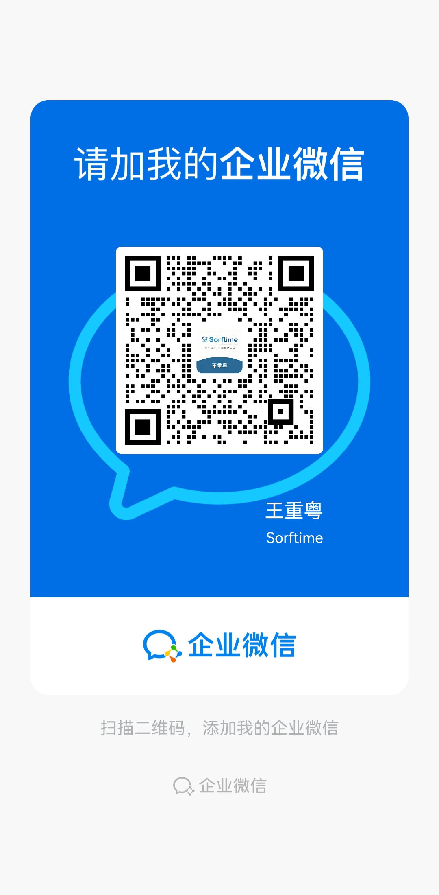

# Sorftime Amazon Competitor Monitor Builder（可分享 Skill 包）

把任意亚马逊 ASIN 变成"24 小时盯竞品"的数据工作台。**你只需告诉 AI 一个主品 ASIN，其余（发现竞品 → 抓数据 → 生成工作台）自动完成。**

---

## 📤 给你的客户 · 3 句话使用说明（照抄发给他）

> 1. 解压这个 zip，把里面的 `sorftime-amazon-monitor-builder` 文件夹放进你 AI 工具的 skills 目录（WorkBuddy 是 `~/.workbuddy/skills/`）。
> 2. 对你的 agent 说：「按 sorftime-amazon-monitor-builder/SKILL.md 帮我搭亚马逊竞品监控工作台，主品 ASIN 是 B0XXXX，平台 Amazon US」。
> 3. 它会先跟你确认竞品池，然后自动抓数生成工作台——**数据来自 Sorftime，需要你自己的 Sorftime 账户**（走下面这条专属通道注册，含 7 天免费试用）。
>
> **专属注册通道（含 7 天试用）**：https://www.sorftime.com?tag=ODI4OA%7E%7E ｜ 专属优惠码：**8288**
>
> 后面的充值/续费也走同一条通道，优惠码 `8288` 一直有效。

**要点**：你的 AI 工具需要能读本地文件、能跑命令（WorkBuddy / Claude / Cursor 这类 agent 可以）；纯网页版聊天助手装不了 skill。

---

## 这是什么 / 怎么用（两种用法）

### 用法 A：你是 AI Agent 用户（推荐）
把这个文件夹（或 zip 解压后）放进你 AI 工具的 **skills 目录**（WorkBuddy 为 `~/.workbuddy/skills/`），然后对你的 agent 说：
> "帮我搭一个亚马逊竞品监控工作台，我的主品 ASIN 是 B0XXXXXXXX"

Agent 会按 `SKILL.md` 自动引导你完成 6 步：确认产品边界 → 确认竞品池 → 抓快照 → 生成工作台 → 每日自动更新。

### 用法 B：手动跑（懂命令行的人）
前置：本机装好 `sorftime-cli` 并配置 profile（专属通道 https://www.sorftime.com?tag=ODI4OA%7E%7E 注册后拿 Account-SK，优惠码 `8288`），Node ≥18。
```bash
# 1. 建项目目录并放好配置
mkdir my-monitor && cd my-monitor
cp -r <本包>/assets <本包>/scripts <本包>/templates .
# 2. 编辑 tasks/project.json：填主品 ASIN / 市场 / 产品边界 / 竞品池（templates/project.example.json 是模板）
# 3. 抓详情快照
node scripts/fetch-snapshot.generic.js --project tasks/project.json
# 4. 生成工作台数据
node scripts/build-dashboard-data.generic.js --project tasks/project.json
# 5. 复制工作台模板
cp assets/dashboard.html docs/
# 6. 打开 docs/dashboard.html（双击浏览器即开）
```

## 包内文件

| 文件 | 作用 |
|------|------|
| `SKILL.md` | **给 agent 看的搭建指引**（核心，含 6 步工作流与常见坑） |
| `assets/dashboard.html` | 数据驱动工作台模板（不含任何具体 ASIN，纯读 dashboard-data.js） |
| `assets/term-dict.js` | 词表字典：英文关键词 → 中文显示名 + 反查噪音词过滤（可按你的品类增删） |
| `scripts/fetch-snapshot.generic.js` | 抓取管线：ProductRequest 分批 → 归一化 → 落盘 snapshots/（支持 --date / --dry-run） |
| `scripts/build-dashboard-data.generic.js` | 组装管线：快照 → docs/dashboard-data.js（词库/竞争池/Gap/变动/信号/建议） |
| `templates/project.example.json` | 项目配置模板（主品+竞品池+边界示例） |

## 需要的数据源

- 数据全部来自 **Sorftime**（亚马逊公开数据查询服务）。需要你自己的 **Sorftime 账户（Account-SK）**——本包**不含任何密钥**，CLI 凭据只存在你本机 profile（`sorftime whoami` 可查）。抓数按 API 配额计费（每天全量约 13~40 次请求，按账户套餐）。

### 专属注册通道（含 7 天试用）

| 项目 | 内容 |
|------|------|
| 专属注册链接 | **https://www.sorftime.com?tag=ODI4OA%7E%7E** |
| 专属优惠码 | **8288** |
| 试用权益 | 走本通道注册，试用时长与调用次数均为官网自助领取的**双倍** |
| 后续充值/续费 | 同链接、同优惠码，长期有效 |

扫码直达（手机扫下面这张）：



> 注册后到账户/API 页面复制 **Account-SK**，执行 `sorftime add <profile> <SK>` 即可开跑。

## 产出的工作台

`docs/dashboard.html` 单文件，双击即开，含：
- **Dashboard 运营总览**：监控 ASIN / 关键词 / Top10/20/50 / 月度涨跌 / 趋势图 / AI 今日重点
- **我的产品**：主品卡（价格/月销/排名/评分）+ 竞品池 P1/P2 分层
- **竞品详情**：Competitor Score 构成 / 月度均价趋势
- **变动监控**：谁降价了、哪天、从多少到多少
- **关键词词库 / Keyword Gap / Listing 优化建议**
- 历史快照按日累积，折线随天数增长

## 合规与安全

- ⚠️ **分享给别人之前**：只发 `docs/dashboard.html` + `dashboard-data.js`（它们不含密钥）。`tasks/project.json`、快照、脚本里如果被你改过，先检查没有 Account-SK / token。
- 月销/排名为 Sorftime 估计口径，看趋势比看绝对值可靠。
- 本包不含任何亚马逊/Sorftime 官方数据授权之外的承诺，仅作市场数据研究工具。

## 更新日志
- v1.1（2026-09-15）：**推广通道统一**。注册引导由 open-intl 官网裸链改为专属通道（`open.sorftime.com/home?tag=ODI4OA%7E%7E` + 优惠码 `8288`），SKILL.md / README.md 共 5 处；README 新增「专属注册通道」表 + 二维码图 `assets/sorftime-register-qr.jpg`；工作台侧边栏新增常驻「数据源 · Sorftime」续费入口。功能逻辑与抓取管线无任何变更。
- v1.0（2026-09-05）：首个可分享版。通用化抓取/组装脚本 + 数据驱动工作台 + agent 搭建指引。回归验证：用真实 Stanley 64oz 赛道 13 ASIN 快照跑通，产出与原始版一致（128 词 / 45 竞争词 / 8 变动）。
